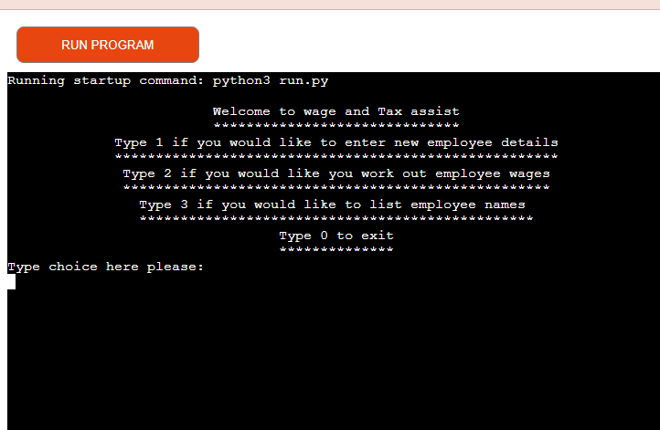
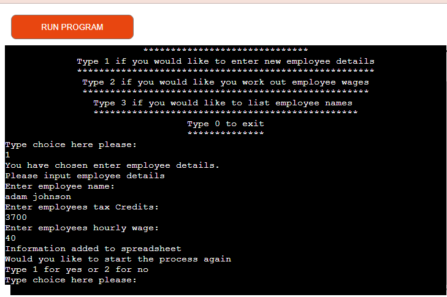
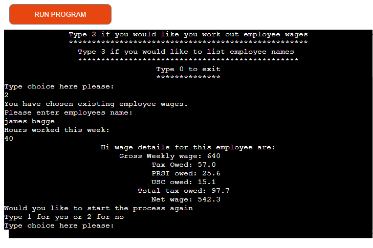
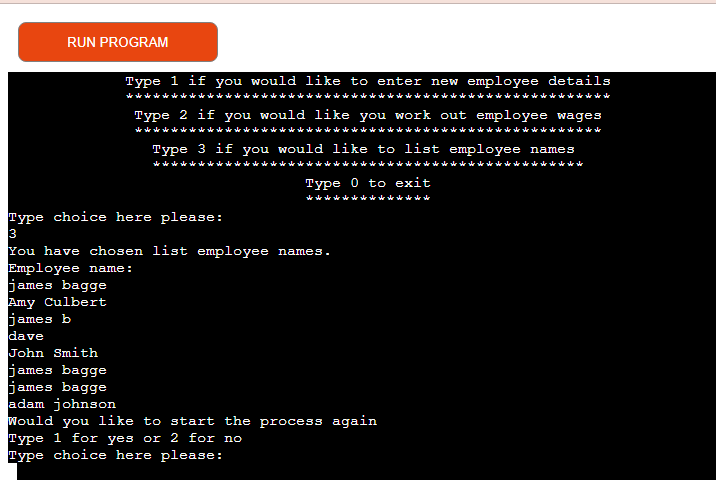
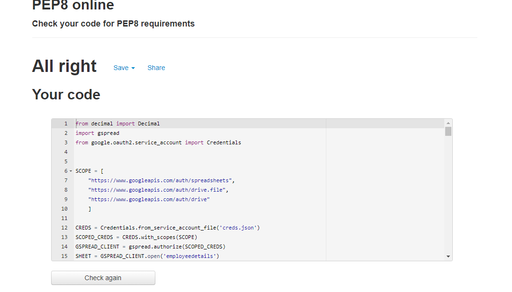

# Project Three: Wage and Tax assist

I created program to be to enable the user to accurately and easily work out employees taxes.

The aim for the game is to build a program that allows the user to save employee data. Then each week be able to easily input hours worked and get back employee wage and tax amounts.

View live site: https://wageandtaxassist.herokuapp.com/

## Table Of Contents

  * [User Stories](#user-stories) 
  * [How to use](#how-to-use)
  * [Technologies used](#technologies-used)
  * [Testing](#testing)
  * [Deployment and Cloning](#deployment-and-cloning)
  * [Credits](#credits)
---

## User Stories
__As a new user__

- I would be like to be able to easily navigate the program.
- I would like to be able use the program intuitively.

__As an existing user__

- I would like to be able to access employee details to be able to work out wages.

## How to use

I wanted this app to be easy for the user to use. so i tried to build it in a way that made sense. 

There are four sections at the start:

- [New Employee](#new-employee)
- [Employee Wages](#employee-wages)
- [List names](#list-names)
- [Exit](#exit)

## New Employee

To get to this section you choose option one, this section will then allow you to input and save three pieces of data to the spreadsheet. It will ask for Employee name, Employee yearly tax credits and Employee hourly wage rate. You will then be given the option to start again or exit.

## Employee Wages

To get to this section you choose option two, this section allows you to work out a current employees wages and tax details. It will ask you for the Employee name and hours worked this week.
It will then check the name against the spread sheet and return the correct wages and taxes. You will then be given the option to start again or exit.

## List names

To get to this section you choose option three, this section allow you to see all employee names currently in the data base.

## Exit

On the main menu you can choose zero to end the program. You can also do this at the end of any section.
## Technologies used

- Python: Used to make the structure and content of the program
- GITPOD: Used to code the game
- GITHUB: Used to store
- HEROKU: Used to deploy and host the program

## Testing

I tried as much as posible to make my code modular and then tested each section to make sure everything was working correctly.
I also went through all the options multiply times to test that i wasn't getting any errors and that everything was acting correctly.

__Bugs & Fixes__

During the build process I had a few bugs. One of them was I was getting was a float decimal error due to the fact i trying to multiply a float and a decimal. I was able to fix this by changing one of my values to an integer.
Another bug was that capitalization could affect the results. I fixed this by making the program convert all name results to lowercase.

__Validator Testing__

Python: No errors reported

## Deployment and Cloning

__Deployment__

This project has been deployed via Heroku, making use of the mock terminal provided by Code Institute.

__Process for deployment__

- Sign up/into Heroku
- Create a new Heroku app
- Give the new app a name
- Select the appropriate region
- Open the "Settings" tab on the Heroku    App dashboard
- Add a new config var
- Set the KEY to "PORT"
- set the VALUE to "8000"
- Set the buildpacks to Python and NodeJS in that order
- Open the "Deploy" tab
- Select the "GitHub" deployment method
- Select "Link to GitHub"
- Link the new Heroku app to the GitHub - - repository & click "Connect"
- Then choose either:
- One:
  - Enable Automatic Deploys
  - Will automatically re-deploy with any updates or changes made
- Two:
  - Deploy Branch Manually
  - Will deploy the current release on GitHub
__Cloning__

In the File menu, click Clone Repository.
- Click the tab that corresponds to the location of the first-project repository.
- Choose the first-project repository from the list of options to clone.
- Click choose and navigate to a local path where you want to clone the repository.
- Click Clone.

## Credits

__Code and Tutorials__

- Learn't more about the different libaries by reading the documnetation to see best practice to impliment into my code. [GSPREAD](https://docs.gspread.org/en/latest/)
- W3schools also helped with me learn extra about more about Python.
- Learn't about Decimal module as an improvement for floars. [Decimal](https://docs.python.org/3/library/decimal.html)